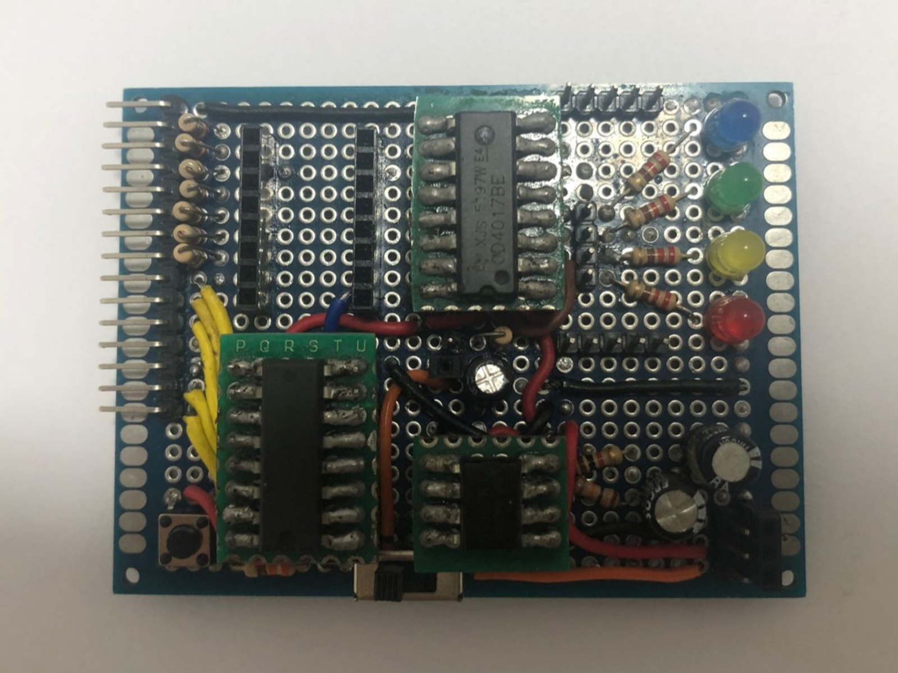
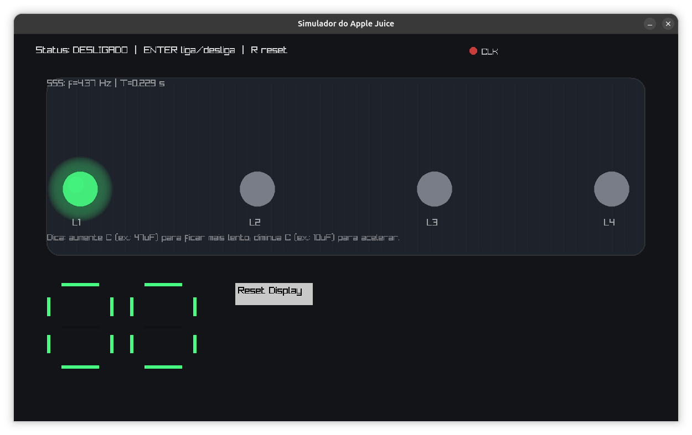

# Apple Juice learning board simulator


O simulador com interface gráfica da placa de aprendizagem, a Apple Juice, foi desenvolvido para o laboratório da FnEsc, no Departamento de Física da UFS. O sistema foi implementado principalmente utilizando o paradigma de programação orientada a objetos, com algumas funcionalidades de caráter procedural.
<br>
A Apple Juice é uma placa de aprendizagem voltada ao estudo de circuitos digitais, construídos com circuitos integrados discretos, como o CD4017, NE555 e CD4026. O sistema oferece suporte à entrada de clock externo, permitindo incrementar a contagem na parte do circuito responsável pela decodificação 
binária para decimal (a parte que possui os CD4026). Além disso, possui um botão de reset para os circuitos CD4017 e um switch para alternar entre o clock externo e o clock interno gerado pelo 555 configurado em modo astável.
<br>
O objetivo deste projeto foi aplicar os conceitos de programação orientada a objetos apresentados em sala de aula na disciplina de POO, sob orientação do professor Carlos Estombelo. Conceitos como tratamento de exceções com try e catch, encapsulamento, herança e polimorfismo foram implementados e utilizados ao longo do desenvolvimento deste código. 
<br>


# Interface gráfica do Apple Juice



# Pré Requisitos
- g++
- raylib 
- cmake


# Como compilar e rodar:
```
# compile o programa
git clone https://github.com/FrankSteps/Apple-juice-learning-board-simulator

# vá para a pasta
cd Apple-juice-learning-board-simulator

# compile 
make

# rode
make run 

# delete a executável
make clear 

```


# Licença
Este projeto está licenciado sob a GNU GPLv3. Veja o arquivo LICENSE para mais detalhes.


# Colaboradores:
| [<br><sub>@franksteps</sub>](https://github.com/franksteps) | [<br><sub>@4rth-gs</sub>](https://github.com/4rth-g) | [<br><sub>@RenatoVPF</sub>](https://github.com/RenatoVPF) | [<br><sub>@Cadu-ux</sub>](https://github.com/Cadu-ux) | [<br><sub>@matheusmatos4</sub>](https://github.com/matheusmatos4) |
| :---: | :---: | :---: | :---: | :---: |


